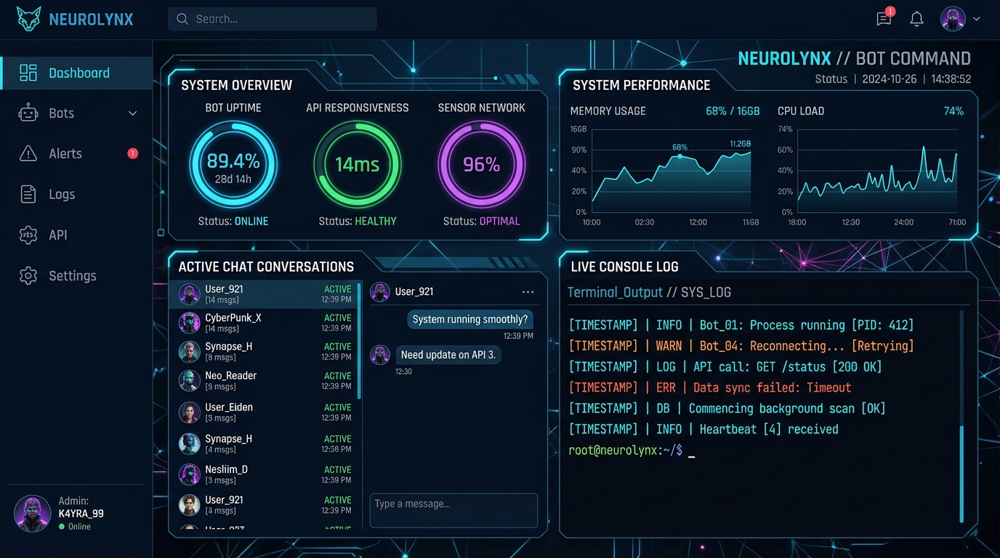
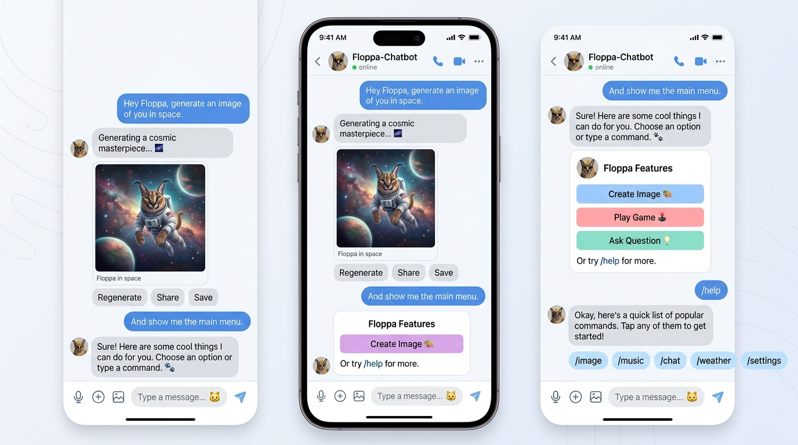

<div align="center">


<br>


# 🐱 FLOPPA-CHATBOT

**Next-Generation 24/7 Facebook Messenger & Business DM Bot Engine**

[](https://nodejs.org/)
[](LICENSE)
[](https://github.com/frnAlt)
[](#-base-architecture--heritage)

</div>

---

## 🌟 Base Architecture & Heritage

**Floppa-Chatbot** is built upon the solid foundation of the **Goat Bot V2** base engine, completely modernized, optimized, and upgraded with:

- ⚡ **Rebuilt Engine (`Floppa.js`)**: Memory leak prevention, aggressive V8 garbage collection management, and high-concurrency event loops.
- 📦 **Native FCA API (`fca/`)**: Bundled directly into the repository, ensuring continuous 24/7 operation without external dependency failures.
- 📱 **Mobile Agent Persona**: Simulates native Android Messenger mobile traffic for maximum account safety on personal & Facebook Business accounts.
- 📥 **Direct Message (DM) & Business Account Mode**: Full support for 1-on-1 Messenger DMs and Business Page DMs with context-aware command dispatching.

### 👤 Developer & Maintainer
- **Developer:** **Gtajisan (Farhan Muh Tasim)**
- **Repository:** [https://github.com/frnAlt/Floppa-Chatbot](https://github.com/frnAlt/Floppa-Chatbot)

---

## 📸 Screenshots & Visual Previews

<div align="center">

### 📊 Live Control Dashboard (No-Login Instant Telemetry & Chat Logs)


<br>

### 💬 Messenger Bot Chat in Action (DM & Group Support)


</div>

---

## 🔥 Key Features

- 📥 **Context-Aware DM & Group Help**: `~help` automatically formats distinct command lists for Direct Messages (DM) vs Group Chats.
- 💡 **Did-You-Mean Command Suggestions**: Built-in Dice's Coefficient bigram matcher (`findSimilarCommand`) suggests closest command names when typos occur.
- 🛠️ **Multi-Source Command Suite**: Integrated top utility and media commands (Catbox uploader, Terabox downloader, AI Logo generator, Pinterest search, Pair coupling, TinyURL shortener, Shazam music identifier, Uptime monitor).
- 📊 **Real-Time Web Dashboard**: Integrated telemetry dashboard showing RAM usage, system uptime, active threads, registered users, and live Messenger message log streaming.

---

## 📁 Repository Structure

```
Floppa-Chatbot/
├── assets/                # Visual media assets (Floppa Banner, Logo & Previews)
│   ├── floppa.jpg
│   ├── floppa-logo.jpg
│   ├── dashboard-preview.jpg
│   └── bot-chat-preview.jpg
├── fca/                   # Native Built-in FCA API Engine
├── bot/                   # Core bot handlers, login & multi-account manager
├── dashboard/             # Live Control Dashboard & Real-Time Log Server
├── database/              # SQLite / MongoDB controllers
├── func/                  # System utilities, memory manager & suggestion matcher
├── languages/             # i18n support (English & Vietnamese)
├── scripts/
│   ├── cmds/              # Command modules (catbox, terabox, logo, pair, etc.)
│   └── events/            # Event handling scripts
├── account.txt            # Facebook Session Cookies / Credentials
├── config.json            # Main Bot Configuration
├── Floppa.js              # Rebuilt Core Engine Runner
├── index.js               # Application Entry Point
└── package.json           # Project Dependencies & Metadata
```

---

## ⚡ Quick Start & Setup Guide

### 1. Requirements
- **Node.js**: `v20.0.0` or higher
- **npm**: `v7.0.0` or higher

### 2. Installation
```bash
git clone https://github.com/frnAlt/Floppa-Chatbot.git
cd Floppa-Chatbot
npm install
```

### 3. Account Cookie Configuration (Safe Mobile Agent Mode)
Export your Facebook account cookies using a browser extension (e.g., *Cookie Editor*) into JSON format, and save into `account.txt`.

For detailed instructions on avoiding account locks, multi-account setup, and mobile agent stealth settings, see the **[Safe Cookie Guide](COOKIE_GUIDE.md)**:

```json
[
  {
    "key": "c_user",
    "value": "YOUR_USER_ID",
    "domain": "facebook.com",
    "path": "/"
  },
  {
    "key": "xs",
    "value": "YOUR_XS_COOKIE",
    "domain": "facebook.com",
    "path": "/"
  }
]
```

### 4. Run Floppa-Chatbot
```bash
npm start
```

### 5. Access Live Web Dashboard
Open your browser and navigate to:
```
http://localhost:5000
```
View live system metrics, active threads, and real-time Messenger chat logs instantly without login walls.

---

## 📜 License

This project is licensed under the **MIT License**.

Built upon **Goat Bot V2** base architecture. Developed & maintained by **Gtajisan (Farhan Muh Tasim)**.
