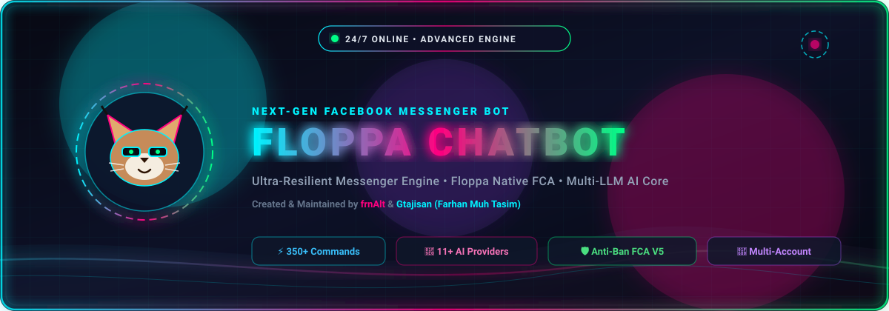
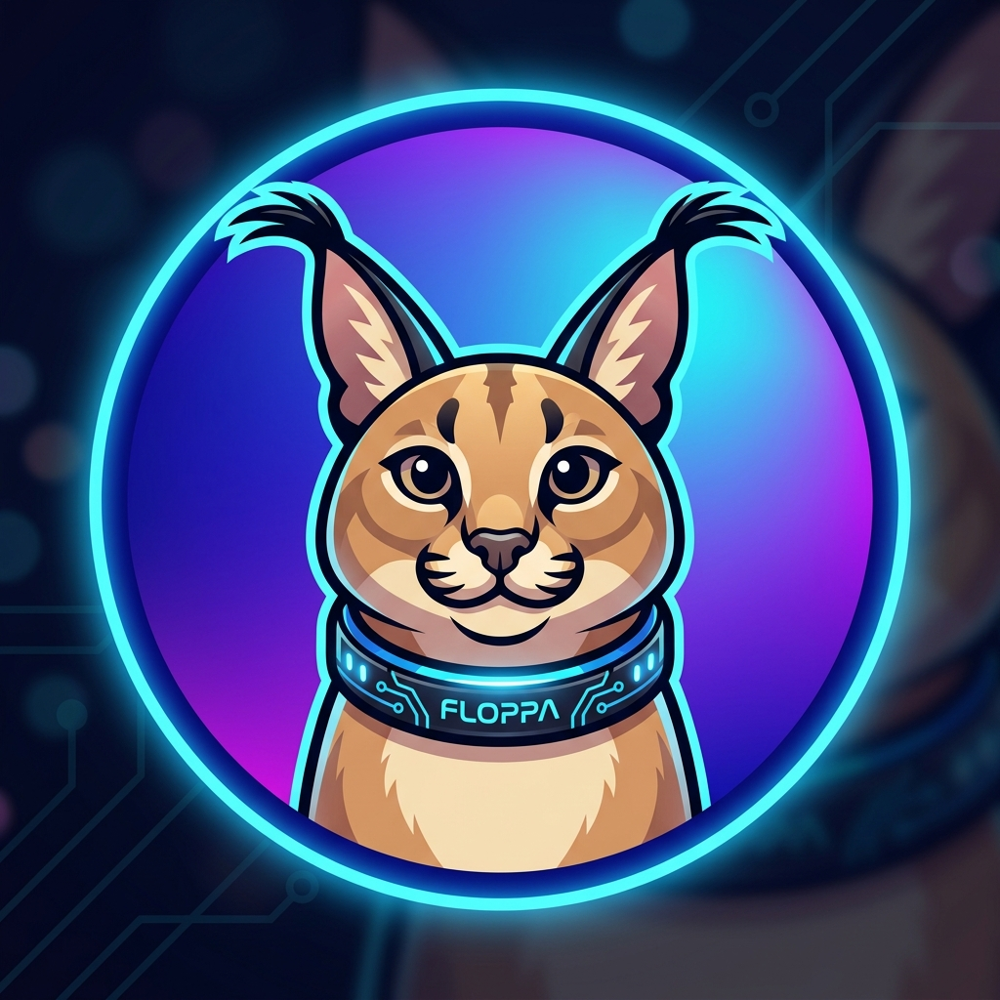

<div align="center">



<br>



# 🐱 FLOPPA-CHATBOT

**Next-Generation 24/7 Facebook Messenger & Business DM Bot Engine**  
*Full Native 1-on-1 Direct Messages (DM) • Group Chats (GC) • Multi-LLM Conversational AI • 280+ Commands*

[](https://nodejs.org/)
[](LICENSE)
[](https://github.com/frnAlt)
[](https://github.com/frnAlt/Floppa-Chatbot)
[](#-featured-commands)
[](scripts/test_cli_runner.js)

</div>

---

## 🌟 Base Architecture & Heritage

**Floppa-Chatbot** is built upon the solid foundation of the **Goat Bot V2** base engine, completely modernized, hardened, and expanded with:

- ⚡ **Rebuilt Core Engine (`Floppa.js`)**: Memory leak mitigation, aggressive V8 garbage collection heuristics, auto-healing watchdog, and high-concurrency event loops.
- 📦 **Native FCA API Engine (`fca/`)**: Bundled directly into `@floppa/fca-native`, supporting Netscape & Cookie-Editor cookie formats, MQTT LightSpeed task 46 dispatch, and auto-reconnect loops.
- 💬 **Native 1-on-1 Direct Message (DM) Engine**: First-class direct messaging to the bot account ID with zero forced group redirects, unthreaded retry fallback, and interactive typing indicators.
- 🧠 **Centralized 11+ LLM AI Core (`system/ai-core.js`)**: Multi-LLM provider routing (`openai`, `gemini`, `claude`, `deepseek`, `ollama`, `groq`, `moonshot`, `glm`, `qwen`, `oneapi`, `sillytavern`) with real-time web search, sandboxed code execution, and automatic public API fallbacks.
- 💾 **Real-Time System Memory DB (`func/systemMemoryDB.js`)**: Persistent event tracking, crash capturing, error diagnosis, and automated self-healing snapshots.
- 📱 **Mobile Agent Persona**: Simulates native Android Messenger mobile traffic for maximum account safety on personal & Facebook Business accounts.

### 👤 Developers & Maintainers
- **Lead Developer & Maintainer:** **frnAlt (Farhan Muh Tasim)**
- **Co-Developer & Core Contributor:** **Gtajisan**
- **Repository:** [https://github.com/frnAlt/Floppa-Chatbot](https://github.com/frnAlt/Floppa-Chatbot)

---

## 💬 Native 1-on-1 Direct Message (DM) & Bot ID Chat Engine

Floppa-Chatbot features **Telegram/Discord/Instagram (InstaBOT) grade Direct Messaging**. Users can open a 1-on-1 DM with the bot account ID and use the entire bot catalog directly in their private inbox:

- ⚡ **Direct MQTT LightSpeed Delivery**: DM responses are sent via MQTT task 46 (`/ls_req`) straight to `event.threadID`, eliminating legacy web HTTP `1545116` errors and avoiding unsolicited group chat redirects.
- ⌨️ **Real-Time Typing Indicators**: The bot automatically broadcasts `sendTypingIndicator(true)` in 1-on-1 DMs while processing commands, giving an immediate, responsive, and polished bot experience.
- 🔀 **Cross-Platform Slash Commands (`/`) & Standard Prefixes (`!`, `~`)**:
  - Run commands with standard prefixes: `!ping`, `!help`, `!ai`, `!sing`
  - Run commands with slash shortcuts: `/ping`, `/help`, `/chat`, `/image`
  - Run commands prefixless in DM: `ping`, `help`, `sing`, `weather`
- 🤖 **Interactive Conversational AI (`scripts/cmds/chat.js`)**:
  - Just talk to the bot in DM! The bot answers conversational questions naturally using multi-turn context memory.
  - Continuous multi-turn dialogue via `onReply`: reply to any bot message to keep conversing without typing the command again.
  - Subcommands: `!chat reset`, `!chat status`, `!chat provider <name>`.
- 🛡️ **Dedicated Private Room Manager (`!dm`)**:
  - For advanced administration or users who prefer a dedicated unencrypted sandbox room.
  - Admin relay: `!dm send <userID> <message>` sends messages directly to users with bi-directional `onReply` relay.
  - List registered private threads: `!dm list`.
- 🔌 **InstaBOT Compatibility Layer**:
  - `api.sendMessageToUser(msg, userID, callback)`
  - `message.sendToUser(userID, form, callback)`
  - `utils.sendMessageToUser(api, targetUID, form, callback)`

---

## 🤖 11+ Supported AI Model Services

Floppa-Chatbot includes built-in support for **11+ AI providers**, complete with official API key handling, dynamic switching, and seamless public URL fallbacks:

| Provider | Service / Endpoint | Default Models |
| :--- | :--- | :--- |
| **OpenAI** | Official API / Compatible | `gpt-4o`, `gpt-4o-mini`, `o1-preview`, `o1-mini` |
| **Google Gemini** | Google Generative Language API | `gemini-1.5-flash`, `gemini-1.5-pro`, `gemini-2.0-flash` |
| **Anthropic Claude** | Anthropic API | `claude-3-5-sonnet`, `claude-3-haiku`, `claude-3-opus` |
| **DeepSeek AI** | DeepSeek Official API | `deepseek-chat`, `deepseek-r1`, `deepseek-v3` |
| **Groq Cloud** | Groq LPU Inference Engine | `llama-3.3-70b-versatile`, `mixtral-8x7b-32768` |
| **Local Ollama** | Self-Hosted Open-Weights | `llama3.1`, `qwen2.5`, `deepseek-r1`, `mistral` |
| **Moonshot AI (Kimi)** | Moonshot API | `moonshot-v1-8k`, `moonshot-v1-32k` |
| **Zhipu GLM** | GLM BigModel API | `glm-4`, `glm-4-flash` |
| **Alibaba Qwen** | DashScope / ModelStudio | `qwen-max`, `qwen-plus`, `qwen-turbo` |
| **OneAPI / Aggregators** | Custom OpenAI Endpoints | Any custom model specified via `ONEAPI_BASE_URL` |
| **SillyTavern** | Local RP Endpoints | Character card evaluation and roleplay models |

---

## 🔥 Featured Commands (280+ Loaded)

- 🐱 **/chat** (`/talk`, `/bot`, `/c`, `/floppa`): Interactive conversational AI chatbot with multi-turn memory and unbroken `onReply` continuous dialogue.
- 🧠 **/ai** (`/ask`, `/agent`, `/gpt`): Agentic AI core with autonomous web search tool use, sandboxed code interpreter, and RAG knowledge base.
- 🎨 **/image** (`/dalle`, `/imagine`): Generates high-definition AI digital art from text prompts.
- 🖼️ **/edit** (`/filter`, `/transform`): Applies AI transformations and stylization to replied images.
- 🔍 **/upscale** (`/4k`, `/hd`): Enhances image resolution to crystal-clear 4K quality.
- ✂️ **/removebg** (`/nobg`, `/rbg`): Removes photo backgrounds and exports transparent PNGs.
- 🎵 **/sing** (`/play`, `/music`): Searches, streams, and plays songs with rich metadata and audio attachments.
- 📹 **/alldl** (`/download`, `/dl`): Universal video and audio downloader for YouTube, TikTok, Facebook, Instagram, and more.
- 📖 **/quran** (`/alquran`): Read Al-Quran verses, Bengali translations, and listen to Alafasy audio recitations.
- 🐙 **/github** (`/gh`): Search GitHub users, repository statistics, commits, and releases.
- 👥 **/friendlist** (`/fl`): FCA Friend List manager with search, pagination, and unfriending.
- 🔒 **/dm** (`/privatedm`, `/room`): Manage dedicated unencrypted private rooms and admin-to-user relay.
- ⌨️ **/typing**: FCA typing indicator controller (`on`/`off`/`duration`).
- 🎨 **/metatheme**: Messenger thread color theme switcher.
- 🟢 **/activestatus**: Toggle online active presence on Facebook Messenger.
- 📊 **/ping**: Real-time bot latency, uptime, and system telemetry monitor.

---

## 📁 Repository Structure

```
Floppa-Chatbot/
├── assets/                # Visual media assets (Floppa Banner, Logo & Previews)
├── fca/                   # Native Built-in FCA Engine (@floppa/fca-native)
│   ├── src/
│   │   ├── apis/          # sendMessage, sendTypingIndicator, createNewGroup, etc.
│   │   └── utils/         # Universal cookie parser, MQTT client, formatter
├── bot/                   # Core bot handlers, login & multi-account manager
│   ├── handler/           # handlerAction.js, handlerEvents.js (event dispatch)
│   └── login/             # login.js, checkLiveCookie.js
├── dashboard/             # Live Control Dashboard & Real-Time Web Server (Port 5000)
├── database/              # SQLite / MongoDB controllers & system memory storage
├── func/                  # System utilities & telemetry
│   ├── privateThreadManager.js # Unencrypted private rooms & DM delivery
│   ├── systemMemoryDB.js       # Real-time event log & crash memory DB
│   ├── cacheManager.js         # Auto-cleaning temporary file manager
│   └── systemStats.js          # Hardware & latency metrics
├── system/                # Centralized AI Core Engine (11+ LLM Providers & Tools)
│   └── ai-core.js
├── languages/             # i18n support (English & Vietnamese)
├── scripts/
│   ├── cmds/              # 280+ Loaded bot commands (chat, ai, help, ping, dm, etc.)
│   ├── events/            # Bot event handlers (join, leave, reaction, rankup)
│   └── test_cli_runner.js # 54-check diagnostic self-test suite
├── account.txt            # Facebook Session Cookies (Netscape / JSON)
├── config.json            # Main Bot Configuration (prefix, admins, options)
├── Floppa.js              # Rebuilt Core Engine Runner
├── utils.js               # Global Utilities, message wrappers & DM routing
├── index.js               # Application Entry Point
└── package.json           # Project Dependencies & Metadata
```

---

## ⚡ Quick Start & Setup Guide

### 1. Requirements
- **Node.js**: `v20.0.0` or higher (LTS recommended)
- **npm**: `v9.0.0` or higher

### 2. Installation
```bash
git clone https://github.com/frnAlt/Floppa-Chatbot.git
cd Floppa-Chatbot
npm install
```

### 3. Account Cookie Configuration
Export your Facebook account cookies using [Cookie-Editor](https://cookie-editor.com/) or [cointool](https://cointool.app/) in JSON or Netscape format, and paste into `account.txt`:

```json
[
  {
    "key": "c_user",
    "value": "YOUR_FACEBOOK_USER_ID",
    "domain": "facebook.com",
    "path": "/"
  },
  {
    "key": "xs",
    "value": "YOUR_XS_TOKEN",
    "domain": "facebook.com",
    "path": "/"
  }
]
```

### 4. Configuration (`config.json`)
Set your Admin UIDs and bot prefix in `config.json`:
```json
{
  "prefix": "!",
  "nickNameBot": "Floppa Bot 🐱",
  "adminBot": ["YOUR_ADMIN_FB_UID"],
  "noPrefix": true,
  "antiInbox": false
}
```

### 5. Automated Self-Test Diagnostic Runner
Verify your entire setup, FCA engine, commands, and live session before starting:
```bash
node scripts/test_cli_runner.js
```
*(Runs 54 automated diagnostic tests across syntax, commands, DM/GC workflows, MQTT, and session health).*

### 6. Start Floppa-Chatbot
```bash
npm start
```

### 7. Access Live Web Dashboard
Open your browser at `http://localhost:5000` to view live system metrics, active threads, and real-time Messenger chat logs.

---

## 📜 Developers & License

This project is licensed under the **MIT License** - see the [LICENSE](LICENSE) file for details.

Developed & Maintained with ❤️ by **[frnAlt](https://github.com/frnAlt) & [Gtajisan](https://github.com/Gtajisan) (Farhan Muh Tasim)**.
