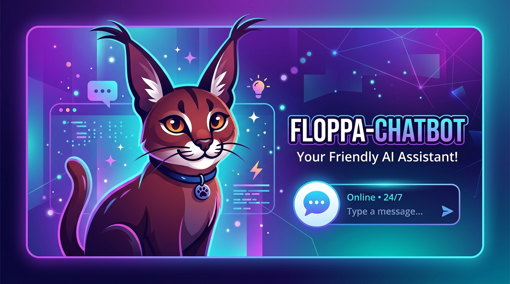

<div align="center">



# 🐱 FLOPPA-CHATBOT

**Next-Generation Facebook Messenger Bot Powered by Floppa Engine**

[](https://nodejs.org/)
[](LICENSE)
[-ff69b4?style=for-the-badge)](https://github.com/frnAlt)
[](#fca-api-integration)

</div>

---

## 🌟 Overview

**Floppa-Chatbot** is a fully rebuilt, high-performance, modular Facebook Messenger bot platform. Built on top of an updated core architecture with built-in **FCA API** integration (`fca/` directory directly inside the repository), Floppa-Chatbot ensures seamless session management, high availability, multi-account auto-switching, and extreme memory efficiency.

### 👤 Developer & Maintainer
- **Lead Developer:** **Gtajisan (Farhan Muh Tasim)**
- **Repository:** [https://github.com/frnAlt/Floppa-Chatbot](https://github.com/frnAlt/Floppa-Chatbot)

---

## 🔥 Key Features

- 🚀 **Integrated FCA API (`fca/`)**: Custom Facebook Chat API built directly into the repository for guaranteed stability without third-party package breaks.
- ⚡ **Rebuilt Core System (`Floppa.js`)**: Modernized event loop, enhanced memory garbage collection management, zero memory leaks.
- 🔄 **Multi-Account Manager**: Automatic account fallback & live cookie refresh support.
- 🌐 **Web Dashboard**: Interactive web dashboard for bot configuration, monitoring, and live logs.
- 🛠️ **Modular Command System**: Dynamic reloading for commands and event scripts without restarting the bot.
- 🛡️ **Spam & Rate Protection**: Built-in command rate limiting, anti-inbox, whitelist mode, and security layers.

---

## 📁 Repository Structure

```
Floppa-Chatbot/
├── assets/                # Visual media assets (Floppa 2D Mascot)
│   └── floppa.jpg
├── fca/                   # Native Built-in FCA API Module
│   ├── dist/
│   ├── package.json
│   └── README.md
├── bot/                   # Core bot handlers, login & multi-account manager
├── dashboard/             # Integrated Express Web Dashboard
├── database/              # SQLite / MongoDB controllers
├── func/                  # System utilities & memory management
├── languages/             # i18n support (English & Vietnamese)
├── scripts/
│   ├── cmds/              # Command modules
│   └── events/            # Event handling scripts
├── account.txt            # Facebook Session Cookies / Credentials
├── config.json            # Main Bot Configuration
├── configCommands.json    # Command configuration & aliases
├── Floppa.js              # Rebuilt Core System Runner
├── index.js               # Application Entry Point
└── package.json           # Node.js Dependencies & Metadata
```

---

## ⚡ Quick Start & Installation

### 1. Prerequisites
- **Node.js**: `v20.0.0` or higher
- **npm**: `v7.0.0` or higher

### 2. Clone Repository
```bash
git clone https://github.com/frnAlt/Floppa-Chatbot.git
cd Floppa-Chatbot
```

### 3. Install Dependencies
```bash
npm install
```

### 4. Configure Facebook Account
Export your Facebook account cookies using a browser extension (e.g. *Cookie Editor*) into JSON format, and save them into `account.txt`:

```json
[
  {
    "key": "c_user",
    "value": "YOUR_USER_ID",
    "domain": "facebook.com",
    "path": "/"
  },
  {
    "key": "xs",
    "value": "YOUR_XS_COOKIE",
    "domain": "facebook.com",
    "path": "/"
  }
]
```

### 5. Launch Floppa-Chatbot
```bash
npm start
```

---

## 🛠️ Configuration (`config.json`)

Customize bot settings in `config.json`:

```json
{
  "prefix": "~",
  "nickNameBot": "Floppa Bot 🐱",
  "adminBot": ["61588057525081"],
  "devUsers": ["61588057525081"],
  "timeZone": "Asia/Dhaka",
  "autoRestart": {
    "time": null
  }
}
```

---

## 🧩 FCA API Integration

Floppa-Chatbot directly bundles the **FCA API** under `fca/`. The login module automatically fetches and executes the local FCA API code without relying on unverified external packages.

To update or inspect FCA internal mechanics:
```javascript
const { login } = require('./fca');
```

---

## 📜 License

This project is licensed under the **MIT License**.

Developed with ❤️ by **Gtajisan (Farhan Muh Tasim)**.
