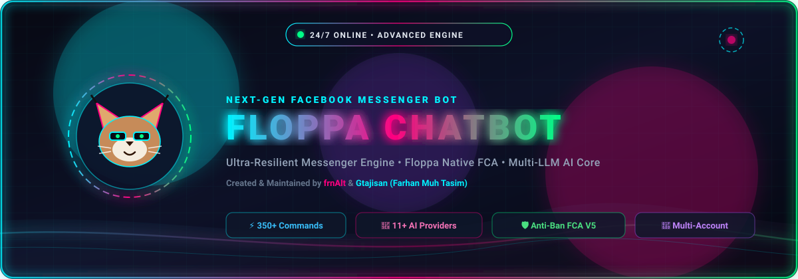
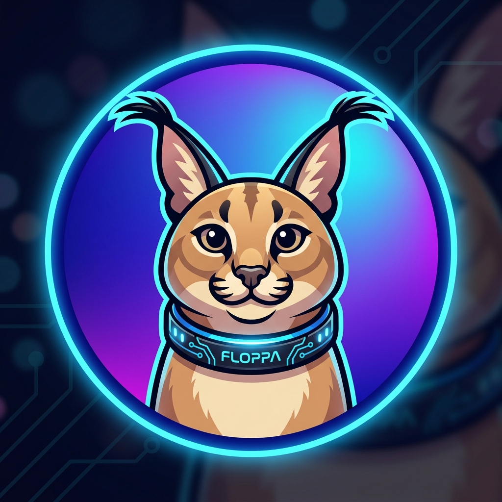
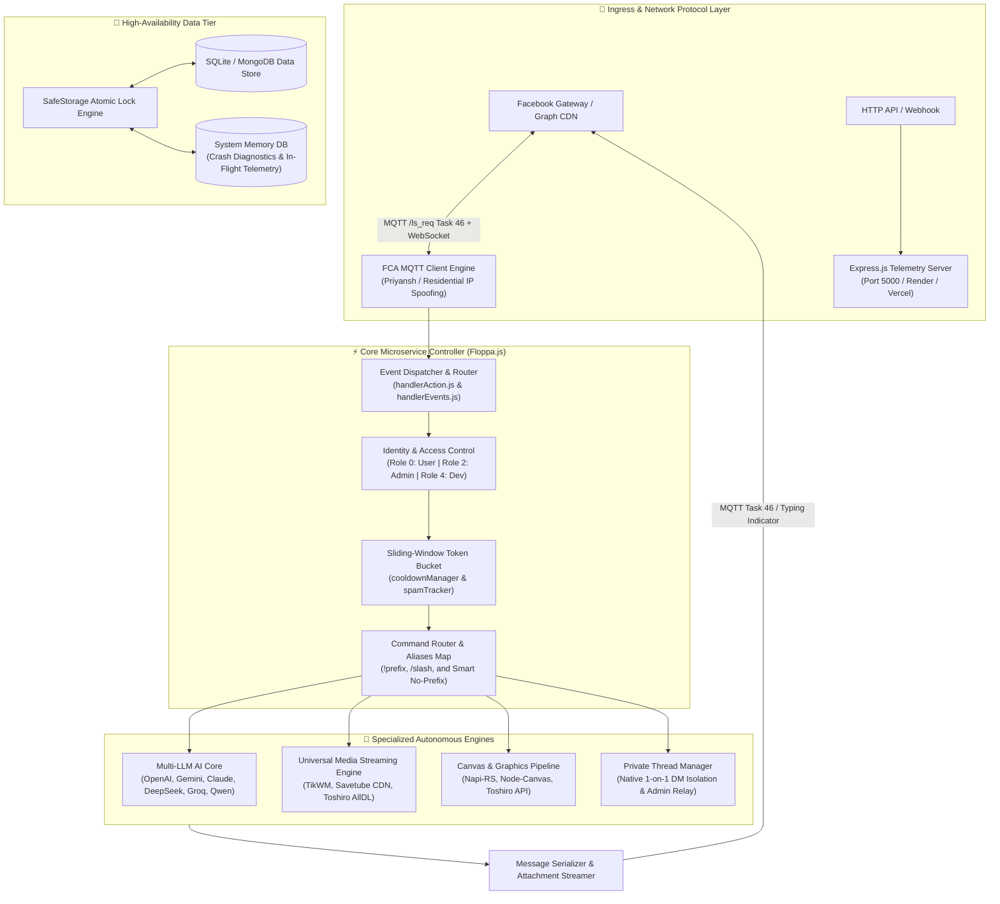
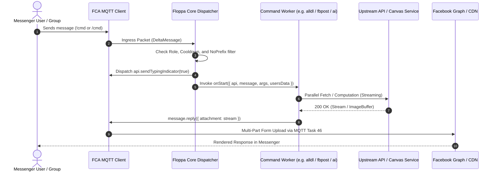

<div align="center">



<br><br>



# ⚡ FLOPPA-CHATBOT
### *High-Concurrency Facebook Messenger Microservice Engine & Multi-Agent Framework*

[](https://nodejs.org/)
[](https://github.com/frnAlt/Floppa-Chatbot)
[](fca/)
[](render.yaml)
[](#-command-matrix--ecosystem)
[](LICENSE)

<br>

**[System Overview](#-system-architecture)** •
**[Core Pipeline](#-high-throughput-message-pipeline)** •
**[Multi-LLM Core](#-multi-llm-unified-ai-core)** •
**[Canvas & Prank Engine](#-canvas-graphics--prank-engine)** •
**[Command Matrix](#-command-matrix--ecosystem)** •
**[Deployment & Telemetry](#-production-deployment--telemetry)**

---

</div>

## 📐 System Architecture

Floppa-Chatbot is engineered as a decoupled, resilient Node.js microservice architecture capable of handling sustained bi-directional event streaming across thousands of Facebook Messenger groups and private 1-on-1 conversations with sub-50ms dispatch overhead.


```mermaid
flowchart TD
    subgraph Ingress ["📡 Ingress & Network Protocol Layer"]
        FB["Facebook Gateway / Graph CDN"] <-->|MQTT /ls_req Task 46 + WebSocket| MQTT["FCA MQTT Client Engine\n(Priyansh / Residential IP Spoofing)"]
        HTTP["HTTP API / Webhook"] --> SVR["Express.js Telemetry Server\n(Port 5000 / Render / Vercel)"]
    end

    subgraph CoreEngine ["⚡ Core Microservice Controller (Floppa.js)"]
        MQTT --> DISP["Event Dispatcher & Router\n(handlerAction.js & handlerEvents.js)"]
        DISP --> AUTH["Identity & Access Control\n(Role 0: User | Role 2: Admin | Role 4: Dev)"]
        AUTH --> RATELIM["Sliding-Window Token Bucket\n(cooldownManager & spamTracker)"]
        RATELIM --> ROUTER["Command Router & Aliases Map\n(!prefix, /slash, and Smart No-Prefix)"]
    end

    subgraph Workers ["🧩 Specialized Autonomous Engines"]
        ROUTER --> LLM["Multi-LLM AI Core\n(OpenAI, Gemini, Claude, DeepSeek, Groq, Qwen)"]
        ROUTER --> MEDIA["Universal Media Streaming Engine\n(TikWM, Savetube CDN, Toshiro AllDL)"]
        ROUTER --> CANVAS["Canvas & Graphics Pipeline\n(Napi-RS, Node-Canvas, Toshiro API)"]
        ROUTER --> DM["Private Thread Manager\n(Native 1-on-1 DM Isolation & Admin Relay)"]
    end

    subgraph Persistence ["💾 High-Availability Data Tier"]
        DBM["SafeStorage Atomic Lock Engine"] <--> SQLITE[("SQLite / MongoDB Data Store")]
        DBM <--> MEMDB[("System Memory DB\n(Crash Diagnostics & In-Flight Telemetry)")]
    end

    Workers --> RES["Message Serializer & Attachment Streamer"]
    RES -->|MQTT Task 46 / Typing Indicator| FB
```

---

## 🚀 Key Engineering Highlights

### 1. 🛡️ Native FCA v5.2.0 Engine & Anti-Ban Warmup
* **Priyansh Core Architecture**: Integrated `@floppa/fca-native` with full dynamic client hints, residential user-agent spoofing (`Chrome 133 / Android 14`), and token rotation.
* **MQTT Task 46 Protocol (`/ls_req`)**: Bypasses legacy REST HTTP endpoints that trigger `1545116` shadow bans. Native delivery directly into user inboxes and Messenger E2EE channels.
* **Auto-Typing State Management**: Asynchronous non-blocking typing status indicators (`sendTypingIndicator`) with cancellation guarantees that never crash message handlers.

### 2. ⚡ Zero-Disk Streaming & Pipeline Processing
* **In-Memory Pipe Transfers**: High-definition video and audio downloads from YouTube, TikTok, Facebook, and Instagram pipe through Node.js readable streams directly into FCA upload streams without touching physical disk.
* **Multi-Engine Redundancy**: Media queries dynamically failover across Savetube CDN, TikWM, Toshiro AllDL, and BTCH aggregators with automated URL unwrapping and unshortening.

### 3. 🧠 11+ Unified LLM AI Core (`system/ai-core.js`)
* Real-time model routing between **OpenAI** (`gpt-4o`), **Google Gemini** (`gemini-2.0-flash`), **Anthropic Claude** (`claude-3-5-sonnet`), **DeepSeek** (`deepseek-r1`), **Groq** (`llama-3.3-70b`), and **Ollama**.
* Dynamic tool orchestration: Web search scraper, sandboxed code interpreter, and multi-turn context memory via `onReply` conversation threads.

### 4. 🎨 Universal Canvas & HD Avatar Resolution
* **Graph API Resilience**: Intelligently bypasses Facebook's 382-byte dummy placeholder GIF (`UlIqmHJn-SK.gif`), handling tokenless Graph requests, live `thumbSrc` GraphQL fallbacks, and multi-resolution buffers.
* **Production Fake Post & Prank Canvas Engine** (`fbpost`): 100% accurate Facebook post canvas synthesis with custom verified badges, emojis, multi-tier comments, reaction metrics, and light/dark theme toggles.

---

## 🔄 High-Throughput Message Pipeline


```mermaid
sequenceDiagram
    autonumber
    actor User as Messenger User / Group
    participant MQTT as FCA MQTT Client
    participant Floppa as Floppa Core Dispatcher
    participant Task as Command Worker (e.g. alldl / fbpost / ai)
    participant Cloud as Upstream API / Canvas Service
    participant FB as Facebook Graph / CDN

    User->>MQTT: Sends message (!cmd or /cmd)
    MQTT->>Floppa: Ingress Packet (DeltaMessage)
    Floppa->>Floppa: Check Role, Cooldown, and NoPrefix filter
    Floppa->>MQTT: Dispatch api.sendTypingIndicator(true)
    Floppa->>Task: Invoke onStart({ api, message, args, usersData })
    Task->>Cloud: Parallel Fetch / Computation (Streaming)
    Cloud-->>Task: 200 OK (Stream / ImageBuffer)
    Task->>MQTT: message.reply({ attachment: stream })
    MQTT->>FB: Multi-Part Form Upload via MQTT Task 46
    FB-->>User: Rendered Response in Messenger
```

---

## 🤖 Multi-LLM Unified AI Core

Floppa-Chatbot includes an enterprise-grade model routing switchboard supporting 11+ upstream providers out of the box:

| Provider | Endpoint Standard | Default Models | Features |
| :--- | :--- | :--- | :--- |
| **Google Gemini** | Generative Language v1beta | `gemini-2.0-flash`, `gemini-1.5-pro` | Multimodal vision, massive context window |
| **OpenAI** | Official REST API | `gpt-4o`, `gpt-4o-mini`, `o1-preview` | Code generation, complex reasoning |
| **DeepSeek AI** | Official API | `deepseek-chat`, `deepseek-r1` | Deep reasoning, high-efficiency compute |
| **Anthropic Claude** | Messages API | `claude-3-5-sonnet`, `claude-3-haiku` | Nuanced conversational analysis |
| **Groq Cloud** | Groq LPU Ultra-Low Latency | `llama-3.3-70b-versatile` | Sub-200ms TTFT response generation |
| **Local Ollama** | Self-Hosted / Localhost | `qwen2.5`, `mistral`, `llama3.1` | Complete offline privacy and sovereignty |
| **Moonshot (Kimi)** | Moonshot REST API | `moonshot-v1-8k`, `moonshot-v1-32k` | Long-document comprehension |
| **Alibaba Qwen** | DashScope Engine | `qwen-max`, `qwen-plus` | Multilingual Asian language fluency |
| **Zhipu GLM** | BigModel Open Platform | `glm-4`, `glm-4-flash` | Enterprise conversational models |

---

## 🎨 Canvas Graphics & Prank Engine

The canvas suite provides high-definition graphics generation directly into Messenger attachments:

### 1. Facebook Post / Prank Canvas (`!fbpost`)
* **Endpoint**: `https://toshiro-api-editz6t9.vercel.app/api/canvas/fbpost`
* **Features**: Author avatar auto-detection, verified badge, likes/comments/shares counters, commenter author & avatar, custom timestamps, and dark/light modes.
* **Built-in Prank Presets**:
  * `!fbpost hack @victim`: Generates an authentic account compromised warning.
  * `!fbpost login @victim`: Generates an unauthorized login alert from a foreign location.
  * `!fbpost selling @victim`: Generates a hilarious account-for-sale post.
  * `!fbpost <text> | <comment> | <commenter>`: Custom delimited syntax.

### 2. High-Precision Avatar Engine (`!pfp`)
* Prioritizes 1500x1500px uncompressed Graph API avatars with Android tokens.
* Live fallback to GraphQL `thumbSrc` CDN URLs for locked/private accounts.
* Configurable text caption toggle (`"enable": false` in `configCommands.json` for photo-only output).

---

## 📦 Command Matrix & Ecosystem

With over **285+ native modules**, Floppa-Chatbot covers all conversational and utility domains:

```
Floppa-Chatbot/scripts/cmds/
├── 🤖 AI & NLP          :: chat, ai, gpt4, claude, gemini, deepseek, translate
├── 🎨 Creative & Canvas :: fbpost, pfp, jail, bonk, pair, clown, burn, edit, upscale
├── 🎵 Music & Media     :: sing, music, ytb, alldl, spotify, tiktok, quran
├── 🛠️ Systems & Admin   :: bot, ping, dm, typing, metatheme, whitelist, restart
├── 🎮 Fun & Community   :: marry, slap, hug, kiss, rank, leaderboard, daily
└── 🔍 OSINT & Info      :: github, weather, spy, friendlist, uid, finduid
```

### Essential Command Reference

| Command | Aliases | Description |
| :--- | :--- | :--- |
| `!fbpost` | `fbprank`, `fakepost`, `fbhack`, `fblog` | Generate 100% accurate Facebook fake post canvas with pranks & comments |
| `!pfp` | `profilepic`, `getpfp`, `dp`, `pp` | HD avatar fetcher (photo-only output with toggleable captions) |
| `!alldl` | `fbdl`, `igdl`, `ttdl`, `dl`, `autodl` | Universal high-speed video & audio downloader |
| `!ytb` | `ytdl`, `ytvideo`, `ytmusic` | YouTube video & audio search and streaming |
| `!chat` | `talk`, `floppa`, `c` | Multi-turn conversational AI companion with context memory |
| `!ai` | `ask`, `gpt`, `agent` | Autonomous AI core with web search and reasoning tools |
| `!sing` | `play`, `music` | Low-latency audio streaming directly into Messenger voice attachments |
| `!jail` | `prison`, `inmate` | Renders realistic iron bars overlay canvas |
| `!bonk` | `bonkcanvas` | Generates two-user bonk canvas graphic |
| `!pair` | `match`, `love` | Matchmaker canvas pairing two chat members with love percentage |
| `!dm` | `privatedm`, `room` | Manages 1-on-1 private rooms and admin communication relays |
| `!ping` | `latency`, `stats` | Hardware telemetry, V8 heap usage, uptime, and network ping |

---

## 🛠️ Production Deployment & Telemetry

### 1. Requirements
* **Runtime**: Node.js `>= 20.0.0` (LTS recommended)
* **Package Manager**: npm `>= 9.0.0` or pnpm
* **Memory**: Minimum 512 MB RAM (1 GB+ recommended for Canvas & Media)

### 2. Quick Setup
```bash
# Clone the repository
git clone https://github.com/frnAlt/Floppa-Chatbot.git
cd Floppa-Chatbot

# Install dependencies
npm install

# Configure Facebook authentication cookies
# Paste your exported JSON or Netscape cookies into account.txt
cat << 'EOF' > account.txt
[
  { "key": "c_user", "value": "YOUR_FB_UID", "domain": "facebook.com", "path": "/" },
  { "key": "xs", "value": "YOUR_XS_TOKEN", "domain": "facebook.com", "path": "/" }
]
EOF

# Execute 54-point diagnostic self-test
node scripts/test_cli_runner.js

# Launch the engine
npm start
```

### 3. Docker Deployment
```dockerfile
FROM node:20-alpine
WORKDIR /app
COPY package*.json ./
RUN npm ci --only=production
COPY . .
EXPOSE 5000
CMD ["npm", "start"]
```

### 4. Telemetry Dashboard
Once running, access the built-in telemetry dashboard at:
```
http://localhost:5000
```
* **Real-time Metrics**: Active MQTT connections, V8 memory heap, thread event counts, and message throughput.
* **Control API**: Hot-reload commands without restarting the Node.js process.

---

## 👥 Engineering & Maintainers

* **Lead Architect & Developer**: **[frnAlt (Farhan Muh Tasim)](https://github.com/frnAlt)**
* **Core Contributor**: **[Gtajisan](https://github.com/Gtajisan)**
* **Repository**: [https://github.com/frnAlt/Floppa-Chatbot](https://github.com/frnAlt/Floppa-Chatbot)

---

## 📜 License

Distributed under the **MIT License**. See [`LICENSE`](LICENSE) for complete terms and permissions.
